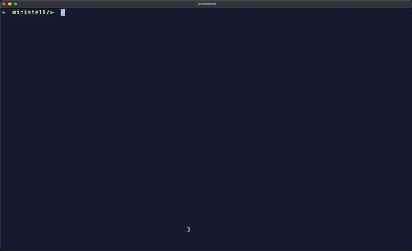

# Minishell

Minishell is a small shell program written in C. It aims to mimic some features of a standard Unix shell while being simple and lightweight.  




## Features

- Run simple commands

- Handle input/output redirection

- Support for pipes

- Command history

- Manage environment variables

- Built-in commands (like cd, exit, etc.)

## Installation

To compile the project, make sure you have `gcc` installed on your machine. Clone the repository and compile the code:

  
```bash

git  clone  https://github.com/OmarTou76/42minishell.git
```
```bash
cd  42minishell
```
```bash
make
```
